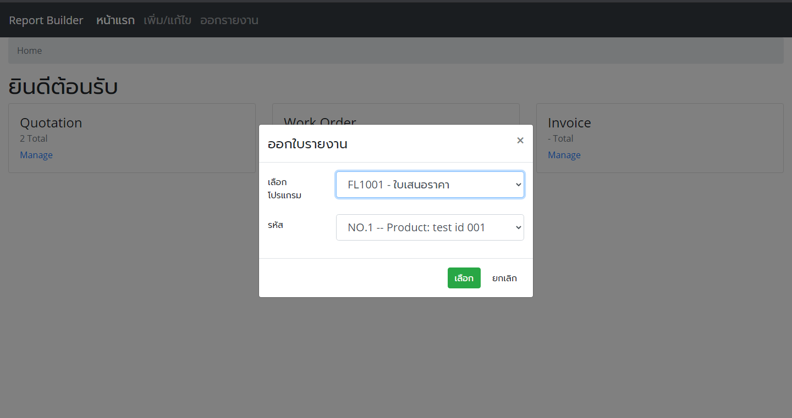

# Report Builder

 

Report builder is my first freelance contact that didn't came out (because the problem about financial of client). It's basicly a web app form report generator that will be replace an oldest system (the original program was create for DOS on around 1990~)

## Demo Picture

## Application Stack

- Front-End: __Java Server Page (JSP), HTML, Bootstrap 4, JQuery__
- Back-End: __Java 8 with Servlet API__
- Web Server: __Apache Tomcat 9__
- Database: __MariaDB__

#### Libary

- [Gson](https://search.maven.org/search?q=a:gson)
- [Jasper Report](https://community.jaspersoft.com/project/jasperreports-library/releases)
- [MariaDB/MySQL Connector J](https://mariadb.com/kb/en/about-mariadb-connector-j/)

## File include

- Web Application
- Database [reportbuild.sql](reportbuild.sql)

## Issue and Bug

- todo

## Owner and Permission

- Create By: [lzy3me](https://github.com/lzy3me)
- Create At: October 2019
- Do whatever you want that isn't against the [LICENSE](LICENSE)